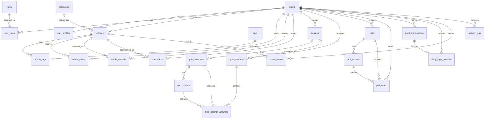

# ERD dan Struktur Database MVP Jepangku

## 1. Ringkasan Desain Database

Database MVP Jepangku dirancang untuk mendukung portal berita interaktif bertema Jepang dengan fitur artikel, kontribusi user, review admin, quiz, polling/voting, bookmark, sistem poin, activity log, dan weekly leaderboard.

Walaupun MVP hanya berfokus pada aplikasi News, struktur database dibuat global-ready agar nanti dapat dikembangkan menjadi ekosistem multi-app yang mencakup:

```txt id="9d1emd"
jepangku.com
news.jepangku.com
learn.jepangku.com
admin.jepangku.com
```

Prinsip utama desain database:

1. Data identitas user dipisahkan dari data aktivitas news.
2. Sistem poin menggunakan transaksi, bukan hanya total poin di tabel user.
3. Leaderboard dihitung dari transaksi poin.
4. Beberapa tabel penting memiliki `source_app` agar bisa dipakai oleh News dan LMS di masa depan.
5. Quiz News dan Quiz LMS dapat dibedakan menggunakan `source_app` dan `quiz_type`.
6. Polling dan voting menggunakan struktur yang sama dengan pembeda `poll_type`.
7. Artikel user memiliki status review yang jelas.
8. Admin MVP berada dalam aplikasi yang sama, tetapi struktur role tetap bisa berkembang.

## 2. Standar Teknis Database

Rekomendasi database:

```txt id="nilmyw"
PostgreSQL
```

Alasan:

1. Cocok untuk aplikasi modern.
2. Mendukung enum, JSONB, indexing yang baik, dan query agregasi.
3. Cocok untuk sistem leaderboard dan activity log.
4. Lebih fleksibel untuk pengembangan multi-app di masa depan.

Jika menggunakan MySQL, struktur tetap bisa dipakai dengan sedikit penyesuaian pada enum dan JSON field.

## 3. Konvensi Penamaan

Konvensi tabel:

```txt id="cfo4gz"
snake_case
plural table name
```

Contoh:

```txt id="di744h"
users
articles
point_transactions
quiz_attempts
```

Konvensi foreign key:

```txt id="k9mnws"
[nama_entity]_id
```

Contoh:

```txt id="j38qyw"
user_id
article_id
category_id
quiz_id
```

Konvensi timestamp:

```txt id="7bhux3"
created_at
updated_at
deleted_at
```

`deleted_at` digunakan jika ingin memakai soft delete.

## 4. Enum Utama

Enum digunakan agar status dan tipe data konsisten.

### 4.1 source_app_enum

Digunakan untuk membedakan asal data antar aplikasi.

```txt id="0bl75f"
news
learn
system
```

Pada MVP, mayoritas data memakai:

```txt id="k5o91f"
news
```

Nanti LMS dapat memakai:

```txt id="3bekoy"
learn
```

### 4.2 user_role_enum

Role awal MVP:

```txt id="t2tcnt"
user
admin
```

Role future:

```txt id="0rqn7c"
super_admin
editor
author
moderator
instructor
student
```

Untuk MVP, cukup gunakan `user` dan `admin`.

### 4.3 user_status_enum

Status user:

```txt id="c74b0v"
active
inactive
banned
```

### 4.4 article_status_enum

Status artikel:

```txt id="g41d8u"
draft
pending_review
published
rejected
archived
```

### 4.5 article_visibility_enum

Visibility artikel:

```txt id="2nknr7"
public
private
unlisted
```

Untuk MVP, gunakan `public`.

### 4.6 quiz_status_enum

Status quiz:

```txt id="l4drbb"
draft
active
inactive
archived
```

### 4.7 quiz_type_enum

Tipe quiz:

```txt id="dgev6g"
trivia
knowledge
personality
lesson_assessment
```

Untuk MVP News, prioritas:

```txt id="nmk2pw"
trivia
knowledge
```

Untuk LMS nanti:

```txt id="qbq9ez"
lesson_assessment
```

### 4.8 poll_type_enum

Tipe polling/voting:

```txt id="lxbocl"
polling
voting
```

### 4.9 poll_status_enum

Status polling/voting:

```txt id="3lz4dh"
draft
active
closed
archived
```

### 4.10 point_activity_type_enum

Jenis aktivitas poin:

```txt id="c2qnii"
article_read
poll_joined
quiz_completed
quiz_correct_answer
daily_login
article_shared
article_bookmarked
manual_adjustment
```

Future untuk LMS:

```txt id="aauotb"
lesson_completed
course_completed
assignment_completed
exam_completed
```

### 4.11 activity_action_enum

Jenis activity log:

```txt id="1pr7w7"
created
updated
deleted
submitted
approved
rejected
published
archived
read
bookmarked
shared
voted
completed
login
logout
```

## 5. Daftar Tabel Utama

Tabel MVP Jepangku:

```txt id="5gmmgc"
users
user_profiles
roles
user_roles
categories
tags
articles
article_tags
article_views
article_reviews
bookmarks
quizzes
quiz_questions
quiz_options
quiz_attempts
quiz_attempt_answers
polls
poll_options
poll_votes
point_transactions
activity_logs
daily_login_rewards
share_events
homepage_sections
admin_settings
```

Catatan:

1. `roles` dan `user_roles` dipakai agar lebih global-ready.
2. Untuk MVP sederhana, role juga bisa disimpan langsung di `users.role`, tetapi lebih baik pakai tabel role agar siap berkembang.
3. `point_transactions` menjadi fondasi utama sistem poin dan leaderboard.
4. `activity_logs` menjadi fondasi audit aktivitas.
5. `source_app` digunakan pada tabel yang berpotensi dipakai lintas aplikasi.

## 6. Struktur Tabel Detail

## 6.1 users

Menyimpan identitas utama akun Jepangku.

Tabel ini harus netral dan tidak terlalu spesifik ke News karena akan menjadi dasar shared auth di masa depan.

```txt id="yns7u6"
users
- id: uuid, primary key
- name: varchar(150), not null
- username: varchar(80), unique, not null
- email: varchar(190), unique, not null
- password_hash: varchar(255), not null
- avatar_url: text, nullable
- status: user_status_enum, default active
- email_verified_at: timestamp, nullable
- last_login_at: timestamp, nullable
- created_at: timestamp
- updated_at: timestamp
- deleted_at: timestamp, nullable
```

Catatan:

1. Gunakan `password_hash`, bukan `password`.
2. Email tidak ditampilkan di leaderboard.
3. `email_verified_at` disiapkan walaupun MVP belum memakai email verification.
4. `deleted_at` berguna jika menggunakan soft delete.

Relasi:

```txt id="x7fyz8"
users 1 - 1 user_profiles
users M - M roles melalui user_roles
users 1 - M articles
users 1 - M bookmarks
users 1 - M point_transactions
users 1 - M quiz_attempts
users 1 - M poll_votes
```

## 6.2 user_profiles

Menyimpan profil publik user.

```txt id="2bh47t"
user_profiles
- id: uuid, primary key
- user_id: uuid, foreign key -> users.id, unique, not null
- display_name: varchar(150), nullable
- bio: text, nullable
- headline: varchar(180), nullable
- location: varchar(120), nullable
- website_url: text, nullable
- created_at: timestamp
- updated_at: timestamp
```

Catatan:

1. `display_name` dapat digunakan di leaderboard.
2. Profil dipisah agar tabel `users` tetap fokus pada auth identity.

## 6.3 roles

Menyimpan role sistem.

```txt id="mcgfi2"
roles
- id: uuid, primary key
- name: varchar(80), unique, not null
- label: varchar(120), nullable
- description: text, nullable
- created_at: timestamp
- updated_at: timestamp
```

Seed awal:

```txt id="gmggbr"
admin
user
```

## 6.4 user_roles

Pivot user dan role.

```txt id="xmeox3"
user_roles
- id: uuid, primary key
- user_id: uuid, foreign key -> users.id, not null
- role_id: uuid, foreign key -> roles.id, not null
- source_app: source_app_enum, default news
- created_at: timestamp
```

Unique constraint:

```txt id="g02fod"
unique(user_id, role_id, source_app)
```

Catatan:

1. Dengan `source_app`, user bisa menjadi admin di News tetapi bukan admin di LMS.
2. Ini sesuai keputusan bahwa admin News dan admin LMS belum tentu sama.

Contoh:

```txt id="k9hj6c"
user A = admin di news
user A = user di learn
```

## 6.5 categories

Menyimpan kategori artikel.

```txt id="vk59y4"
categories
- id: uuid, primary key
- source_app: source_app_enum, default news
- name: varchar(120), not null
- slug: varchar(140), not null
- description: text, nullable
- icon_url: text, nullable
- color: varchar(30), nullable
- is_active: boolean, default true
- sort_order: int, default 0
- created_at: timestamp
- updated_at: timestamp
- deleted_at: timestamp, nullable
```

Unique constraint:

```txt id="9dcmho"
unique(source_app, slug)
```

Seed kategori awal:

```txt id="ox9n7z"
Anime
Manga
Culture
Travel
Food
Event
Technology
Lifestyle
Education
Fun
```

## 6.6 tags

Menyimpan tag artikel.

```txt id="lzp9zd"
tags
- id: uuid, primary key
- source_app: source_app_enum, default news
- name: varchar(120), not null
- slug: varchar(140), not null
- created_at: timestamp
- updated_at: timestamp
```

Unique constraint:

```txt id="1oqpgy"
unique(source_app, slug)
```

## 6.7 articles

Menyimpan artikel/berita.

```txt id="s6c5lx"
articles
- id: uuid, primary key
- source_app: source_app_enum, default news
- author_id: uuid, foreign key -> users.id, not null
- category_id: uuid, foreign key -> categories.id, nullable
- title: varchar(220), not null
- slug: varchar(260), not null
- excerpt: text, nullable
- content: text, not null
- cover_image_url: text, nullable
- status: article_status_enum, default draft
- visibility: article_visibility_enum, default public
- is_featured: boolean, default false
- is_hot: boolean, default false
- published_at: timestamp, nullable
- archived_at: timestamp, nullable
- view_count: bigint, default 0
- weekly_view_count: bigint, default 0
- bookmark_count: bigint, default 0
- share_count: bigint, default 0
- metadata: jsonb, nullable
- created_at: timestamp
- updated_at: timestamp
- deleted_at: timestamp, nullable
```

Unique constraint:

```txt id="u1gh8t"
unique(source_app, slug)
```

Index penting:

```txt id="uae0bq"
index(status, published_at)
index(category_id)
index(author_id)
index(is_featured)
index(is_hot)
index(view_count)
index(weekly_view_count)
```

Catatan:

1. `view_count`, `bookmark_count`, dan `share_count` adalah denormalized counter untuk performa.
2. Data detail tetap disimpan di tabel masing-masing.
3. `weekly_view_count` dapat dihitung ulang dari `article_views`, tetapi boleh disimpan untuk optimasi.
4. `is_hot` untuk MVP memakai manual flag dari admin.
5. `metadata` dapat dipakai untuk kebutuhan future tanpa mengubah struktur.

## 6.8 article_tags

Pivot artikel dan tag.

```txt id="5u9i4s"
article_tags
- id: uuid, primary key
- article_id: uuid, foreign key -> articles.id, not null
- tag_id: uuid, foreign key -> tags.id, not null
- created_at: timestamp
```

Unique constraint:

```txt id="iogdf2"
unique(article_id, tag_id)
```

## 6.9 article_views

Mencatat view artikel.

```txt id="rqf8pk"
article_views
- id: uuid, primary key
- article_id: uuid, foreign key -> articles.id, not null
- user_id: uuid, foreign key -> users.id, nullable
- session_id: varchar(255), nullable
- ip_hash: varchar(255), nullable
- user_agent: text, nullable
- viewed_at: timestamp, not null
- read_completed_at: timestamp, nullable
- created_at: timestamp
```

Index:

```txt id="7zeb66"
index(article_id, viewed_at)
index(user_id, article_id)
index(session_id, article_id)
```

Catatan:

1. `user_id` nullable agar guest view tetap bisa dicatat.
2. `read_completed_at` digunakan untuk menentukan poin membaca artikel.
3. Untuk privasi, simpan `ip_hash`, bukan IP mentah.
4. Poin baca artikel tetap dicatat di `point_transactions`.

## 6.10 article_reviews

Menyimpan catatan review artikel oleh admin.

```txt id="4ufmm4"
article_reviews
- id: uuid, primary key
- article_id: uuid, foreign key -> articles.id, not null
- reviewer_id: uuid, foreign key -> users.id, not null
- previous_status: article_status_enum, nullable
- new_status: article_status_enum, not null
- note: text, nullable
- reviewed_at: timestamp, not null
- created_at: timestamp
```

Catatan:

1. Digunakan untuk histori approve/reject.
2. Catatan reject disimpan di sini.
3. Artikel yang reject dapat diedit ulang dan submit lagi.

## 6.11 bookmarks

Menyimpan artikel yang disimpan user.

```txt id="zua4nl"
bookmarks
- id: uuid, primary key
- user_id: uuid, foreign key -> users.id, not null
- article_id: uuid, foreign key -> articles.id, not null
- first_bookmarked_at: timestamp, not null
- deleted_at: timestamp, nullable
- created_at: timestamp
- updated_at: timestamp
```

Unique constraint:

```txt id="k6y7qj"
unique(user_id, article_id)
```

Catatan:

1. Jika user unbookmark, gunakan `deleted_at`.
2. Jika bookmark ulang, jangan beri poin lagi karena record lama masih ada.
3. `first_bookmarked_at` menjadi bukti bahwa poin bookmark sudah pernah layak diberikan.

## 6.12 quizzes

Menyimpan quiz.

```txt id="y0wfdj"
quizzes
- id: uuid, primary key
- source_app: source_app_enum, default news
- created_by: uuid, foreign key -> users.id, not null
- title: varchar(220), not null
- slug: varchar(260), not null
- description: text, nullable
- thumbnail_url: text, nullable
- quiz_type: quiz_type_enum, default trivia
- status: quiz_status_enum, default draft
- points_reward: int, default 10
- correct_answer_points: int, default 5
- allow_retry: boolean, default false
- show_result_immediately: boolean, default true
- started_at: timestamp, nullable
- ended_at: timestamp, nullable
- created_at: timestamp
- updated_at: timestamp
- deleted_at: timestamp, nullable
```

Unique constraint:

```txt id="fey2xs"
unique(source_app, slug)
```

Catatan:

1. Pada MVP, `source_app = news`.
2. Quiz LMS nanti bisa memakai `source_app = learn`.
3. `allow_retry` disiapkan, tetapi MVP paling aman `false`.

## 6.13 quiz_questions

Menyimpan pertanyaan quiz.

```txt id="tg69e7"
quiz_questions
- id: uuid, primary key
- quiz_id: uuid, foreign key -> quizzes.id, not null
- question_text: text, not null
- image_url: text, nullable
- sort_order: int, default 0
- created_at: timestamp
- updated_at: timestamp
```

## 6.14 quiz_options

Menyimpan opsi jawaban quiz.

```txt id="xsp93u"
quiz_options
- id: uuid, primary key
- question_id: uuid, foreign key -> quiz_questions.id, not null
- option_text: text, not null
- image_url: text, nullable
- is_correct: boolean, default false
- sort_order: int, default 0
- created_at: timestamp
- updated_at: timestamp
```

Constraint penting:

```txt id="i2vlno"
Setiap quiz_question harus punya minimal 2 options.
Setiap quiz_question harus punya tepat 1 option dengan is_correct = true.
```

Catatan:

1. Constraint “tepat satu jawaban benar” biasanya lebih mudah dijaga di application logic atau database trigger.
2. Untuk MVP, cukup validasi di backend.

## 6.15 quiz_attempts

Menyimpan percobaan user mengikuti quiz.

```txt id="st1s5f"
quiz_attempts
- id: uuid, primary key
- quiz_id: uuid, foreign key -> quizzes.id, not null
- user_id: uuid, foreign key -> users.id, nullable
- session_id: varchar(255), nullable
- score: int, default 0
- total_questions: int, default 0
- correct_answers: int, default 0
- points_awarded: int, default 0
- is_point_awarded: boolean, default false
- started_at: timestamp, nullable
- submitted_at: timestamp, nullable
- created_at: timestamp
```

Index:

```txt id="54oobl"
index(quiz_id, user_id)
```

Constraint untuk MVP login user:

```txt id="wc6pas"
unique(quiz_id, user_id) where user_id is not null
```

Catatan:

1. `user_id` nullable agar guest bisa mencoba quiz.
2. Guest tidak mendapat poin.
3. Untuk MVP user hanya submit sekali.
4. Jika nanti retry diizinkan, unique constraint perlu diubah, dan poin tetap hanya diberikan pada attempt pertama.

## 6.16 quiz_attempt_answers

Menyimpan jawaban user per pertanyaan.

```txt id="y1gkxk"
quiz_attempt_answers
- id: uuid, primary key
- attempt_id: uuid, foreign key -> quiz_attempts.id, not null
- question_id: uuid, foreign key -> quiz_questions.id, not null
- selected_option_id: uuid, foreign key -> quiz_options.id, nullable
- is_correct: boolean, default false
- created_at: timestamp
```

Unique constraint:

```txt id="gybe0g"
unique(attempt_id, question_id)
```

## 6.17 polls

Menyimpan polling dan voting.

```txt id="mcix6g"
polls
- id: uuid, primary key
- source_app: source_app_enum, default news
- created_by: uuid, foreign key -> users.id, not null
- title: varchar(220), not null
- slug: varchar(260), not null
- description: text, nullable
- poll_type: poll_type_enum, default polling
- status: poll_status_enum, default draft
- thumbnail_url: text, nullable
- points_reward: int, default 5
- allow_guest_vote: boolean, default false
- show_result_before_vote: boolean, default false
- started_at: timestamp, nullable
- ended_at: timestamp, nullable
- created_at: timestamp
- updated_at: timestamp
- deleted_at: timestamp, nullable
```

Unique constraint:

```txt id="r6vybc"
unique(source_app, slug)
```

Catatan:

1. `poll_type = polling` untuk polling ringan.
2. `poll_type = voting` untuk voting/event interaktif.
3. Guest boleh melihat, tetapi MVP sebaiknya hanya user login yang vote agar data bersih.

## 6.18 poll_options

Menyimpan opsi polling/voting.

```txt id="u50i8s"
poll_options
- id: uuid, primary key
- poll_id: uuid, foreign key -> polls.id, not null
- option_text: text, not null
- image_url: text, nullable
- vote_count: bigint, default 0
- sort_order: int, default 0
- created_at: timestamp
- updated_at: timestamp
```

Catatan:

1. `vote_count` adalah denormalized counter.
2. Detail vote tetap disimpan di `poll_votes`.

## 6.19 poll_votes

Menyimpan vote user.

```txt id="czrdkf"
poll_votes
- id: uuid, primary key
- poll_id: uuid, foreign key -> polls.id, not null
- option_id: uuid, foreign key -> poll_options.id, not null
- user_id: uuid, foreign key -> users.id, nullable
- session_id: varchar(255), nullable
- ip_hash: varchar(255), nullable
- points_awarded: int, default 0
- is_point_awarded: boolean, default false
- voted_at: timestamp, not null
- created_at: timestamp
```

Unique constraint untuk user login:

```txt id="3o82ln"
unique(poll_id, user_id) where user_id is not null
```

Catatan:

1. User hanya boleh vote satu kali per polling/voting.
2. Guest dapat dicatat dengan `session_id`, tetapi tidak mendapatkan poin.
3. Jika `allow_guest_vote = false`, guest tidak boleh vote.

## 6.20 point_transactions

Fondasi utama sistem poin dan leaderboard.

```txt id="glba90"
point_transactions
- id: uuid, primary key
- user_id: uuid, foreign key -> users.id, not null
- source_app: source_app_enum, default news
- activity_type: point_activity_type_enum, not null
- source_type: varchar(80), not null
- source_id: uuid, nullable
- points: int, not null
- description: varchar(255), nullable
- metadata: jsonb, nullable
- occurred_at: timestamp, not null
- created_at: timestamp
```

Index penting:

```txt id="f16f1x"
index(user_id, occurred_at)
index(source_app, occurred_at)
index(activity_type)
index(source_type, source_id)
```

Anti-duplikasi poin:

Untuk aktivitas yang hanya boleh mendapat poin sekali, gunakan unique constraint berbasis kombinasi.

Contoh konseptual:

```txt id="96i378"
unique(user_id, source_app, activity_type, source_type, source_id)
```

Catatan:

1. Ini mencegah user mendapat poin dua kali dari artikel/quiz/polling yang sama.
2. Untuk daily login, karena `source_id` tidak relevan, sebaiknya gunakan tabel khusus `daily_login_rewards`.
3. `points` bisa positif atau negatif jika nanti ada manual adjustment.

Contoh data:

```txt id="q3liy9"
user_id: U1
source_app: news
activity_type: article_read
source_type: article
source_id: A1
points: 2
```

Contoh future LMS:

```txt id="fqg69k"
user_id: U1
source_app: learn
activity_type: lesson_completed
source_type: lesson
source_id: L1
points: 20
```

## 6.21 daily_login_rewards

Mencegah poin login harian dobel.

```txt id="p8sdu6"
daily_login_rewards
- id: uuid, primary key
- user_id: uuid, foreign key -> users.id, not null
- source_app: source_app_enum, default news
- reward_date: date, not null
- points_awarded: int, default 3
- point_transaction_id: uuid, foreign key -> point_transactions.id, nullable
- created_at: timestamp
```

Unique constraint:

```txt id="oyrbfj"
unique(user_id, source_app, reward_date)
```

Catatan:

1. Pada MVP, login harian dihitung untuk `source_app = news`.
2. Nanti bisa ditentukan apakah daily login berlaku global atau per aplikasi.

## 6.22 share_events

Mencatat share artikel.

```txt id="bue4li"
share_events
- id: uuid, primary key
- user_id: uuid, foreign key -> users.id, nullable
- article_id: uuid, foreign key -> articles.id, not null
- session_id: varchar(255), nullable
- platform: varchar(80), nullable
- points_awarded: int, default 0
- is_point_awarded: boolean, default false
- shared_at: timestamp, not null
- created_at: timestamp
```

Index:

```txt id="7cc4cv"
index(user_id, shared_at)
index(article_id, shared_at)
```

Catatan anti-spam:

1. User login bisa mendapat +5 poin untuk share.
2. Batasi poin share, misalnya maksimal 5 kali per hari.
3. Share event tetap bisa dicatat walaupun poin tidak diberikan.

## 6.23 activity_logs

Mencatat aktivitas penting user/admin.

```txt id="aq9nfl"
activity_logs
- id: uuid, primary key
- user_id: uuid, foreign key -> users.id, nullable
- source_app: source_app_enum, default news
- action: activity_action_enum, not null
- entity_type: varchar(80), not null
- entity_id: uuid, nullable
- description: text, nullable
- metadata: jsonb, nullable
- ip_hash: varchar(255), nullable
- user_agent: text, nullable
- created_at: timestamp
```

Contoh penggunaan:

```txt id="16d5dl"
user submit artikel
admin approve artikel
user mengikuti quiz
user vote polling
user login
```

Catatan:

1. `activity_logs` tidak sama dengan `point_transactions`.
2. Semua aktivitas penting boleh masuk log.
3. Tidak semua activity log menghasilkan poin.

## 6.24 homepage_sections

Mengatur bagian homepage sederhana.

```txt id="cjot73"
homepage_sections
- id: uuid, primary key
- source_app: source_app_enum, default news
- section_key: varchar(100), not null
- title: varchar(180), nullable
- content_type: varchar(80), nullable
- reference_id: uuid, nullable
- is_active: boolean, default true
- sort_order: int, default 0
- metadata: jsonb, nullable
- created_at: timestamp
- updated_at: timestamp
```

Contoh `section_key`:

```txt id="qy8k14"
hero_featured_article
hot_article
active_polling
latest_quiz
leaderboard_preview
```

Catatan:

1. Untuk MVP, bisa juga hanya pakai flag `is_featured` dan `is_hot` di `articles`.
2. Namun tabel ini membuat homepage lebih fleksibel.

## 6.25 admin_settings

Menyimpan setting sederhana aplikasi.

```txt id="smqwmu"
admin_settings
- id: uuid, primary key
- source_app: source_app_enum, default news
- setting_key: varchar(120), not null
- setting_value: jsonb, nullable
- created_at: timestamp
- updated_at: timestamp
```

Unique constraint:

```txt id="a7ffrc"
unique(source_app, setting_key)
```

Contoh setting:

```txt id="h4h39o"
site_name
site_description
default_points_article_read
default_points_quiz_completed
default_points_poll_joined
```

Catatan:

1. Untuk MVP, point rules bisa tetap hardcoded.
2. Tabel ini disiapkan jika nanti admin ingin mengatur setting dari dashboard.

## 7. ERD Konseptual



## 8. Relasi Utama

## 8.1 User dan Role

```txt id="kcq9un"
users M - M roles melalui user_roles
```

Alasan:

1. User bisa punya role berbeda per aplikasi.
2. Admin News tidak harus Admin LMS.
3. Global-ready untuk multi-app.

## 8.2 User dan Artikel

```txt id="0v2go3"
users 1 - M articles
```

Satu user dapat menulis banyak artikel.

## 8.3 Artikel dan Kategori

```txt id="j5hfod"
categories 1 - M articles
```

Satu artikel memiliki satu kategori utama.

## 8.4 Artikel dan Tag

```txt id="e1zrkz"
articles M - M tags melalui article_tags
```

Satu artikel dapat memiliki banyak tag.

## 8.5 Artikel dan Review

```txt id="m5dfye"
articles 1 - M article_reviews
users 1 - M article_reviews sebagai reviewer
```

Digunakan untuk histori approve/reject.

## 8.6 User dan Bookmark

```txt id="10spwn"
users M - M articles melalui bookmarks
```

User dapat menyimpan banyak artikel.

## 8.7 Quiz

```txt id="gd0f3h"
quizzes 1 - M quiz_questions
quiz_questions 1 - M quiz_options
users 1 - M quiz_attempts
quiz_attempts 1 - M quiz_attempt_answers
```

Quiz MVP menggunakan pilihan ganda.

## 8.8 Polling/Voting

```txt id="j3zuib"
polls 1 - M poll_options
users 1 - M poll_votes
poll_options 1 - M poll_votes
```

User hanya dapat vote satu kali per polling/voting.

## 8.9 Poin dan Leaderboard

```txt id="6q7etp"
users 1 - M point_transactions
```

Leaderboard dihitung dari `point_transactions`.

Query konsep:

```txt id="y7ufk5"
SUM(points)
GROUP BY user_id
WHERE source_app = 'news'
AND occurred_at BETWEEN start_of_week AND end_of_week
ORDER BY SUM(points) DESC
```

## 9. Aturan Status Artikel

Flow artikel user:

```txt id="m6les6"
draft
↓
pending_review
↓
published / rejected
↓
Jika rejected → edit ulang → pending_review
↓
Jika published → tampil di portal
↓
Jika archived → tidak tampil di portal
```

Aturan:

1. User dapat membuat draft.
2. User dapat submit artikel menjadi pending review.
3. Admin dapat approve menjadi published.
4. Admin dapat reject dengan catatan.
5. User dapat edit artikel rejected.
6. User dapat hapus artikel jika belum published.
7. Artikel published tidak boleh diedit langsung oleh user pada MVP.
8. Admin dapat archive artikel.

## 10. Aturan Latest, Popular, Trending, Hot

## 10.1 Latest

Berdasarkan:

```txt id="c1skc5"
articles.published_at DESC
```

Syarat:

```txt id="y3d69z"
status = published
visibility = public
```

## 10.2 Popular

Berdasarkan:

```txt id="u64mvq"
articles.view_count DESC
```

## 10.3 Trending

Berdasarkan views dalam 7 hari terakhir.

Sumber utama:

```txt id="gnmoyk"
article_views.viewed_at >= now() - interval '7 days'
```

Untuk optimasi, dapat menggunakan:

```txt id="pwyk9u"
articles.weekly_view_count
```

## 10.4 Hot

Pada MVP berdasarkan manual flag admin:

```txt id="ap65hp"
articles.is_hot = true
```

Future:

```txt id="kov6h3"
views + bookmark + share + poll/quiz engagement
```

## 11. Aturan Poin

## 11.1 Daftar Poin MVP

```txt id="r1s9gn"
article_read: +2
poll_joined: +5
quiz_completed: +10
quiz_correct_answer: +5
daily_login: +3
article_shared: +5
article_bookmarked: +1
```

## 11.2 Aturan Anti-Duplikasi

### Membaca Artikel

Poin hanya diberikan jika belum ada:

```txt id="6v83v0"
point_transactions
WHERE user_id = current_user
AND activity_type = article_read
AND source_type = article
AND source_id = article_id
```

### Bookmark

Poin hanya diberikan jika belum pernah bookmark artikel tersebut.

Cek:

```txt id="6dz98m"
bookmarks unique(user_id, article_id)
```

### Quiz

Poin hanya diberikan jika belum ada attempt berpoin untuk quiz tersebut.

Cek:

```txt id="8qfx5d"
quiz_attempts unique(quiz_id, user_id)
```

Atau cek:

```txt id="22byfv"
point_transactions activity_type = quiz_completed
```

### Polling/Voting

Poin hanya diberikan jika user belum pernah vote.

Cek:

```txt id="4qk9m8"
poll_votes unique(poll_id, user_id)
```

### Daily Login

Poin hanya diberikan satu kali per hari.

Cek:

```txt id="n6cty3"
daily_login_rewards unique(user_id, source_app, reward_date)
```

### Share

Untuk MVP, batasi poin share.

Rekomendasi:

```txt id="rra4a4"
maksimal 5 share berpoin per user per hari
```

Share event tetap dicatat walaupun tidak mendapat poin.

## 12. Leaderboard

Leaderboard tidak perlu tabel utama pada MVP.

Leaderboard dihitung dari:

```txt id="q3nd9o"
point_transactions
```

Weekly leaderboard:

```txt id="gqe0xz"
WHERE occurred_at >= start_of_week
AND occurred_at <= end_of_week
AND source_app = 'news'
GROUP BY user_id
ORDER BY SUM(points) DESC
```

Global-ready leaderboard:

```txt id="7kgbzd"
source_app = news    → News Leaderboard
source_app = learn   → LMS Leaderboard
source_app = all     → Global Leaderboard
```

Jika performa mulai berat, nanti dapat dibuat tabel cache:

```txt id="6o3pmp"
leaderboard_snapshots
```

Namun tabel ini belum wajib untuk MVP.

## 13. Tabel Opsional Future: leaderboard_snapshots

Tidak wajib MVP, tetapi bisa disiapkan nanti.

```txt id="gmz1ha"
leaderboard_snapshots
- id: uuid, primary key
- source_app: source_app_enum
- period_type: varchar(30)
- period_start: date
- period_end: date
- user_id: uuid, foreign key -> users.id
- total_points: int
- rank: int
- metadata: jsonb
- created_at: timestamp
```

Unique constraint:

```txt id="fxpe2x"
unique(source_app, period_type, period_start, user_id)
```

Catatan:

1. Gunakan jika data point transaction sudah besar.
2. Untuk MVP, query langsung dari point transactions masih cukup.

## 14. Global-Ready Design Notes

## 14.1 Kenapa user_roles Memiliki source_app?

Karena keputusan produk menyebut belum ada admin pusat. Admin LMS dan Admin News dapat berbeda.

Dengan `source_app`, role dapat spesifik per aplikasi.

Contoh:

```txt id="w3g6gm"
Habibi = admin di news
Habibi = user di learn
```

## 14.2 Kenapa point_transactions Memiliki source_app?

Agar poin bisa digunakan lintas aplikasi.

Contoh:

```txt id="g8h9e9"
source_app = news  → membaca artikel
source_app = learn → menyelesaikan lesson
source_app = system → bonus manual
```

## 14.3 Kenapa quizzes Memiliki source_app?

Karena quiz News dan quiz LMS berbeda.

```txt id="xm2ajf"
News quiz = engagement
LMS quiz = progress belajar
```

Dengan `source_app`, struktur tetap bisa dipakai tanpa mencampur domain.

## 14.4 Kenapa leaderboard Tidak Dibuat Tabel Utama?

Karena leaderboard adalah hasil agregasi poin.

Sumber kebenaran utama:

```txt id="zlpt30"
point_transactions
```

Jika leaderboard disimpan sebagai tabel utama, risiko data tidak sinkron lebih besar.

## 14.5 Kenapa Data Counter Tetap Ada di Articles?

Field seperti `view_count`, `bookmark_count`, dan `share_count` disimpan untuk performa.

Namun sumber detailnya tetap ada di:

```txt id="v6ykuz"
article_views
bookmarks
share_events
```

Jadi counter dapat dihitung ulang jika perlu.

## 15. Rekomendasi Index Database

Index penting:

```txt id="tg8ykx"
users.email
users.username
user_roles.user_id
user_roles.source_app
articles.slug
articles.status
articles.published_at
articles.category_id
articles.author_id
articles.is_featured
articles.is_hot
article_views.article_id
article_views.viewed_at
bookmarks.user_id
bookmarks.article_id
quizzes.slug
quiz_attempts.user_id
quiz_attempts.quiz_id
polls.slug
poll_votes.user_id
poll_votes.poll_id
point_transactions.user_id
point_transactions.source_app
point_transactions.occurred_at
activity_logs.user_id
activity_logs.created_at
```

## 16. Rekomendasi Constraint Penting

Constraint wajib:

```txt id="dbgp8a"
users.email unique
users.username unique
roles.name unique
user_roles unique(user_id, role_id, source_app)
categories unique(source_app, slug)
tags unique(source_app, slug)
articles unique(source_app, slug)
article_tags unique(article_id, tag_id)
bookmarks unique(user_id, article_id)
quizzes unique(source_app, slug)
quiz_attempt_answers unique(attempt_id, question_id)
polls unique(source_app, slug)
poll_votes unique(poll_id, user_id) where user_id is not null
daily_login_rewards unique(user_id, source_app, reward_date)
admin_settings unique(source_app, setting_key)
```

Constraint konseptual:

```txt id="amj8ql"
Setiap quiz question harus memiliki tepat satu jawaban benar.
Setiap polling/voting minimal memiliki dua opsi.
Artikel published wajib memiliki published_at.
Artikel rejected sebaiknya memiliki review note.
```

Beberapa constraint konseptual lebih aman divalidasi di application layer.

## 17. Rekomendasi Soft Delete

Gunakan soft delete untuk:

```txt id="qovlsb"
users
articles
categories
quizzes
polls
bookmarks
```

Tidak perlu soft delete untuk:

```txt id="qa7qgi"
point_transactions
activity_logs
article_views
poll_votes
quiz_attempts
```

Alasan:

1. Transaksi poin harus menjadi riwayat yang stabil.
2. Activity log sebaiknya tidak dihapus sembarangan.
3. Attempt dan vote adalah data historis.

## 18. Minimum Tables untuk MVP Paling Awal

Jika ingin membangun bertahap, urutan tabel minimal:

### Phase 1 — Auth dan Artikel

```txt id="dvdjb6"
users
user_profiles
roles
user_roles
categories
tags
articles
article_tags
article_reviews
```

### Phase 2 — Interaksi Artikel

```txt id="2s2quc"
article_views
bookmarks
share_events
```

### Phase 3 — Quiz dan Polling

```txt id="2njn2o"
quizzes
quiz_questions
quiz_options
quiz_attempts
quiz_attempt_answers
polls
poll_options
poll_votes
```

### Phase 4 — Poin dan Leaderboard

```txt id="6wg07d"
point_transactions
daily_login_rewards
activity_logs
```

### Phase 5 — Homepage dan Setting

```txt id="jrft5z"
homepage_sections
admin_settings
```

## 19. Rekomendasi Awal Seed Data

Seed awal:

### Roles

```txt id="om0hng"
admin
user
```

### Categories

```txt id="b5e4i5"
Anime
Manga
Culture
Travel
Food
Event
Technology
Lifestyle
Education
Fun
```

### Admin Settings

```txt id="yivwen"
site_name = Jepangku
site_description = Portal media interaktif bertema Jepang untuk pembaca Indonesia
default_points_article_read = 2
default_points_poll_joined = 5
default_points_quiz_completed = 10
default_points_quiz_correct_answer = 5
default_points_daily_login = 3
default_points_article_shared = 5
default_points_article_bookmarked = 1
```

### Source App

```txt id="bil4tk"
news
learn
system
```

## 20. Rekomendasi Query Leaderboard MVP

Konsep query:

```sql id="4nyw6a"
SELECT
    users.id,
    COALESCE(user_profiles.display_name, users.name, users.username) AS display_name,
    users.username,
    users.avatar_url,
    SUM(point_transactions.points) AS weekly_points
FROM point_transactions
JOIN users ON users.id = point_transactions.user_id
LEFT JOIN user_profiles ON user_profiles.user_id = users.id
WHERE point_transactions.source_app = 'news'
  AND point_transactions.occurred_at >= :start_of_week
  AND point_transactions.occurred_at < :end_of_week
GROUP BY users.id, user_profiles.display_name
ORDER BY weekly_points DESC
LIMIT 10;
```

Catatan:

1. Jangan tampilkan email.
2. Gunakan display name atau username.
3. Leaderboard MVP memakai source_app `news`.

## 21. Rekomendasi Query Trending Articles

Konsep query:

```sql id="1mgqyq"
SELECT
    articles.*,
    COUNT(article_views.id) AS views_last_7_days
FROM articles
LEFT JOIN article_views ON article_views.article_id = articles.id
WHERE articles.status = 'published'
  AND articles.visibility = 'public'
  AND article_views.viewed_at >= NOW() - INTERVAL '7 days'
GROUP BY articles.id
ORDER BY views_last_7_days DESC
LIMIT 10;
```

Catatan:

1. Untuk data besar, gunakan cache/counter.
2. Untuk MVP, query langsung masih cukup.

## 22. Rekomendasi Query Popular Articles

Konsep query:

```sql id="ysmqy4"
SELECT *
FROM articles
WHERE status = 'published'
  AND visibility = 'public'
ORDER BY view_count DESC
LIMIT 10;
```

## 23. Rekomendasi Query Latest Articles

Konsep query:

```sql id="nrsm4x"
SELECT *
FROM articles
WHERE status = 'published'
  AND visibility = 'public'
ORDER BY published_at DESC
LIMIT 10;
```

## 24. Rekomendasi Query Hot Articles

Konsep query MVP:

```sql id="sauzc7"
SELECT *
FROM articles
WHERE status = 'published'
  AND visibility = 'public'
  AND is_hot = true
ORDER BY published_at DESC
LIMIT 10;
```

## 25. Kesimpulan Struktur Database

Struktur database MVP Jepangku terdiri dari lima fondasi utama:

```txt id="dmoiix"
1. Identity Foundation
   users, user_profiles, roles, user_roles

2. Content Foundation
   articles, categories, tags, article_tags, article_reviews

3. Engagement Foundation
   article_views, bookmarks, share_events, quizzes, polls

4. Gamification Foundation
   point_transactions, daily_login_rewards, activity_logs

5. Homepage/Admin Foundation
   homepage_sections, admin_settings
```

Keputusan desain paling penting:

```txt id="6xg5iu"
users dibuat netral untuk akun Jepangku pusat
user_roles memakai source_app agar admin News dan admin LMS bisa berbeda
point_transactions menjadi sumber utama poin dan leaderboard
quizzes dan polls memakai source_app agar future-ready
leaderboard dihitung dari point_transactions, bukan disimpan sebagai data utama
artikel user memakai status draft, pending_review, published, rejected, archived
```

Dengan struktur ini, MVP Jepangku bisa dibangun sederhana sebagai News Portal, tetapi tetap memiliki fondasi yang kuat untuk dikembangkan menjadi ekosistem Jepangku multi-app bersama LMS.
