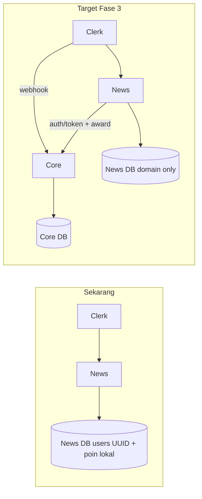

# 🔗 Integrasi Ekosistem — Portal Berita

Panduan integrasi **Jepangku News** dengan **Jepangku Core Service** dan **Clerk**.
Kontrak teknis canonical ada di repo Core: [`jepangku-core/docs/ECOSYSTEM.md`](../../jepangku-core/docs/ECOSYSTEM.md) dan [`jepangku-core/docs/API.md`](../../jepangku-core/docs/API.md).

**Fase dokumentasi:** 0 (selaras kontrak) · **Prioritas implementasi:** Core + News dulu, LMS nanti

---

## 1. Peta dokumentasi (baca yang mana)

| Kebutuhan | Dokumen | Catatan |
| :--- | :--- | :--- |
| **Kontrak API & schema Core** | `jepangku-core/docs/API.md` | Sumber kebenaran teknis |
| **Peta ekosistem lintas-repo** | `jepangku-core/docs/ECOSYSTEM.md` | Arsitektur 3 app |
| **Cutover News ↔ Core (dokumen ini)** | `docs/ecosystem-integration.md` | Keputusan arsitektur + ringkasan fase |
| **Checklist implementasi step-by-step** | `docs/feature-status.md` § Penyatuan Shared Auth | Task per file, migrasi FK, endpoint poin |
| **Status implementasi aktual** | `docs/feature-status.md` | Audit kode, sudah/belum |
| **Roadmap berfase** | `docs/development-roadmap.md` | Fase A–E (sudah v2) |
| **Stack & auth portal saat ini** | `docs/technical-architecture.md` | Kondisi runtime News |
| **Visi produk jangka panjang** | `.agents/05-ecosystem-strategy.md` | ⚠️ Bagian 8–12 = desain v1; lihat §2 di bawah |

---

## 2. Desain v1 vs v2 — jangan campur

Dokumen `.agents/05-ecosystem-strategy.md` (2025) mendeskripsikan tabel `core_*`, endpoint `GET /me`, `POST /points/earn`, dan FK `core_user_id` (UUID internal).

**Implementasi Core aktual (v2)** memakai schema tanpa prefix `core_`, `users.id` = Clerk ID, dan `POST /api/v1/gamification/award`.

| Topik | ❌ Jangan implementasi (v1) | ✅ Gunakan (v2) |
| :--- | :--- | :--- |
| User ID global | UUID `core_users.id` + `clerk_id` | Clerk ID = `users.id` di Core |
| FK di News | `author_core_user_id` | `author_id` = Clerk ID |
| Award poin | `POST /points/earn` | `POST /api/v1/gamification/award` |
| Session claims | `GET /me` verifikasi Clerk | `POST /api/v1/auth/token` → Core JWT |
| Ledger | `core_point_transactions` | `gamification_logs` |

Bagian 1–7 dan 13–15 dari `05-ecosystem-strategy.md` tetap valid sebagai **visi produk**; bagian 8–12 gunakan hanya setelah dibaca tabel pemetaan di [`ECOSYSTEM.md` §6](../../jepangku-core/docs/ECOSYSTEM.md).

---

## 3. Keputusan arsitektur (Fase 0 — locked)

Keputusan ini disepakati agar Core dan News selaras sebelum cutover (LMS mengikuti pola yang sama nanti).

### 3.1 Identitas & auth

| Keputusan | Detail |
| :--- | :--- |
| Auth provider | **Clerk** — satu Clerk Application untuk News, Core webhook, dan LMS nanti |
| User ID lintas app | **Clerk User ID** (`user_2…`) = Core `users.id` = FK di News |
| Webhook Clerk | **Hanya ke Core** — News tidak menerima webhook user |
| Session News (target) | Clerk session → Core JWT via `POST /api/v1/auth/token` |
| Session News (sekarang) | Clerk + JIT sync ke tabel `users` lokal (UUID) — **transisi** |

### 3.2 Data milik siapa

| Data | Pemilik setelah cutover | Sementara (pre-cutover) |
| :--- | :--- | :--- |
| Email, name, avatar global | Core | Duplikat JIT di News |
| XP, poin, level | Core | `users.total_points` + `point_transactions` lokal |
| Username, bio, display name | **News DB** | News DB (Core belum punya field) |
| Role admin portal | Core (`NEWS_EDITOR`) | Enum `Role.ADMIN` lokal |
| Artikel, quiz, poll, komentar | News DB | News DB |

### 3.3 Role mapping

| News (lokal) | Core (`roles.code`) |
| :--- | :--- |
| `USER` | `STUDENT` (default webhook) |
| `ADMIN` | `NEWS_EDITOR` (+ `CORE_ADMIN` jika super-admin) |

### 3.4 Activity types — mapping cutover

| News `lib/points.ts` | Core `activity_types.code` | Status seed Core |
| :--- | :--- | :--- |
| `article_read` | `READ_ARTICLE` | ✅ Ada |
| `daily_login` | `DAILY_LOGIN` | ✅ Ada |
| `article_shared` | `ARTICLE_SHARED` | ⏳ Tambah di Core seed |
| `article_bookmarked` | `ARTICLE_BOOKMARKED` | ⏳ Tambah di Core seed |
| `quiz_completed` | `NEWS_QUIZ_COMPLETED` | ⏳ Tambah (pisah dari LMS `COMPLETED_QUIZ`) |
| `poll_voted` | `POLL_VOTED` | ⏳ Tambah di Core seed |
| `comment_created` | `COMMENT_CREATED` | ⏳ Tambah di Core seed |

Application code untuk semua award News: **`PORTAL_BERITA`**.

### 3.5 Idempotency key (News)

```txt
news:article_read:{articleId}:{clerkId}
news:article_shared:{articleId}:{clerkId}
news:article_bookmarked:{articleId}:{clerkId}
news:quiz_attempt:{attemptId}
news:poll_vote:{pollId}:{questionId}:{clerkId}
news:comment:{targetType}:{targetId}:{clerkId}
news:daily_login:{YYYY-MM-DD}:{clerkId}
```

---

## 4. Kondisi News saat ini vs target



| Aspek | Sekarang | Target |
| :--- | :--- | :--- |
| Login | Clerk ✅ | Clerk ✅ |
| User table | `users.id` UUID + `clerk_id` | Minimal profile keyed by Clerk ID |
| FK konten | → UUID lokal | → Clerk ID |
| Poin | `lib/points.ts` lokal | Core `gamification/award` |
| Core client | Belum ada | `lib/core/` + env `CORE_*` |

---

## 5. Checklist fase integrasi (News)

### Fase 0 — Dokumentasi ✅

- [x] Kontrak v2 terdokumentasi (`ecosystem-integration.md`, Core `ECOSYSTEM.md`)
- [x] Roadmap & steering di-update ke v2
- [x] Banner v1 di `05-ecosystem-strategy.md`

### Fase 1 — Core siap (repo `jepangku-core`)

- [ ] Core deploy + Clerk webhook aktif
- [ ] Seed activity types News (§3.4)
- [ ] Assign `NEWS_EDITOR` untuk admin portal di Core
- [ ] Verifikasi manual: webhook → `auth/token` → `gamification/award`

### Fase 2 — News bridge (non-breaking)

- [ ] Env `CORE_API_URL`, `CORE_SERVICE_TOKEN` di News
- [ ] Modul `lib/core/` (token exchange, award wrapper)
- [ ] Shadow call `POST /auth/token` setelah login (log only, non-blocking)
- [ ] (Opsional) Dual-write poin: lokal + Core paralel
- [ ] Skrip sync user existing (`clerk_id` → pastikan ada di Core)

### Fase 3 — News cutover

- [ ] Migrasi FK: semua `user_id` / `author_id` → Clerk ID
- [ ] Ganti `awardPoints()` → Core only
- [ ] `getCurrentUser()` / admin: Core JWT + role Core
- [ ] UI poin/leaderboard dari Core API
- [ ] Hapus `point_transactions`, `daily_login_rewards`, kolom `total_points`
- [ ] Sederhanakan `users` → profil portal saja (username, bio)

### Fase 4 — Verifikasi

- [ ] Login → user di Core DB
- [ ] Aktivitas berita → poin di Core, tidak double
- [ ] Admin dengan `NEWS_EDITOR` akses panel admin
- [ ] Update `feature-status.md`

### Fase 5 — LMS (nanti)

Salin pola Fase 2–3: `User.id` = Clerk ID, `application: LMS`, tanpa `lib/points.ts` lokal.

---

## 6. Environment variables (News)

Tambahkan ke `.env` saat Fase 2:

```env
# Jepangku Core Service (Fase 2+)
CORE_API_URL="http://localhost:8080"
CORE_SERVICE_TOKEN="<sama dengan Core CORE_SERVICE_TOKEN>"
```

Clerk tetap seperti `.env.example` yang ada. **Jangan** set `CLERK_WEBHOOK_SECRET` di News — webhook hanya di Core.

---

## 7. Modul kode (rencana Fase 2)

```
lib/core/
├── client.ts      # fetch wrapper ke CORE_API_URL
├── auth.ts        # exchangeClerkToken()
├── gamification.ts # awardXp() → POST /gamification/award
└── types.ts       # response types (atau import dari Eden Treaty)
```

Implementasi kode: checklist lengkap per file di [`docs/feature-status.md` § Penyatuan Shared Auth](./feature-status.md#-penyatuan-shared-auth--core-service).

---

## 8. Referensi cepat API Core

| Aksi | Request |
| :--- | :--- |
| Tukar Clerk → Core JWT | `POST /api/v1/auth/token` + `Authorization: Bearer <clerk_session>` |
| Profil + poin | `GET /api/v1/users/me` + Bearer Core JWT |
| Award poin (server) | `POST /api/v1/gamification/award` + Bearer service token |
| Leaderboard | `GET /api/v1/leaderboard?limit=50` |

Detail lengkap: [`jepangku-core/docs/API.md`](../../jepangku-core/docs/API.md).

---

## 9. Gap Core yang tidak memblok cutover News

| Gap | Keputusan sementara |
| :--- | :--- |
| Username di Core | Tetap di News DB |
| Bio / profil extended | Tetap `user_profiles` News |
| Riwayat transaksi `/points` | Baca dari Core belum ada endpoint — tampilkan snapshot JWT atau tunda UI |
| Spend poin | Tidak dipakai News MVP |
| Notifikasi, membership | Fase E |
