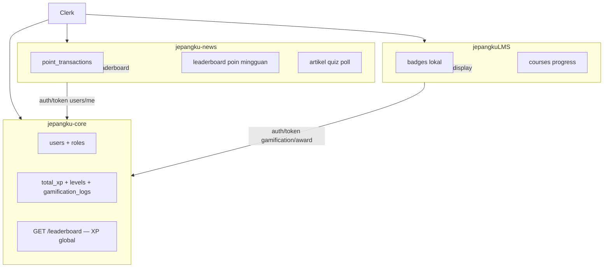

# 🔗 Integrasi Ekosistem — Portal Berita

Panduan integrasi **Jepangku News** dengan **Jepangku Core Service** dan **Clerk**.
Kontrak teknis canonical ada di repo Core: [`jepangku-core/docs/ECOSYSTEM.md`](../../jepangku-core/docs/ECOSYSTEM.md) dan [`jepangku-core/docs/API.md`](../../jepangku-core/docs/API.md).

**Schema Core:** `2.1.0` · **Fase dokumentasi:** 0 ✅ · **Implementasi identitas:** Fase 1 + 3 ✅ · **QA production:** ⏳

---

## 0. Pembagian tanggung jawab (Core v2.1 — wajib dibaca)

Sejak **schema v2.1.0**, `jepangku-core` fokus pada **identitas & akses global**. Gamifikasi **tidak lagi terpusat** — setiap app punya model sendiri.

| Lapisan | Pemilik | Isi |
| :--- | :--- | :--- |
| **Identitas global** | Core | `users` (Clerk sync), role app-scoped, JWT (`POST /auth/token`) |
| **XP + level global** | Core | `total_xp`, `current_level`, `gamification_logs` — dipakai utama **LMS** |
| **Poin portal** | **News DB** | Ledger poin, saldo, riwayat `/points` — **bukan** di Core |
| **Leaderboard poin** | **News DB** | Peringkat mingguan/bulanan dari transaksi poin portal |
| **Badge + progres LMS** | **LMS DB** + Core XP | Badge lokal LMS; XP/level dari Core JWT & `gamification/award` |
| **Leaderboard XP** | Core API | `GET /api/v1/leaderboard` — ranking XP global (konteks **LMS**, bukan poin berita) |



**Yang dihapus dari Core (v2.1):** `current_points`, `points_gained`, tabel `badges` / `user_badges`, endpoint `GET /badges`. Lihat [`jepangku-core/docs/API.md` § Breaking changes](../../jepangku-core/docs/API.md).

> **⚠️ Gap implementasi News (Juni 2026):** sebagian kode masih memanggil `awardXp()` ke Core dan leaderboard dari `GET /api/v1/leaderboard` (XP global). Target: poin + leaderboard sepenuhnya di News DB — lihat [`feature-status.md` § Migrasi poin lokal](./feature-status.md#-migrasi-poin-lokal--leaderboard-portal).

---

## 1. Peta dokumentasi (baca yang mana)

| Kebutuhan | Dokumen | Catatan |
| :--- | :--- | :--- |
| **Kontrak API & schema Core** | `jepangku-core/docs/API.md` | Sumber kebenaran teknis |
| **Peta ekosistem lintas-repo** | `jepangku-core/docs/ECOSYSTEM.md` | Arsitektur 3 app |
| **Cutover News ↔ Core (dokumen ini)** | `docs/ecosystem-integration.md` | Keputusan arsitektur + ringkasan fase |
| **Checklist implementasi step-by-step** | `docs/feature-status.md` § Penyatuan Shared Auth | Task per file, migrasi FK, endpoint poin |
| **Status implementasi aktual** | `docs/feature-status.md` | Daftar prioritas Prio 1–18 + audit kode |
| **Rencana teknis backlog aktif** | `docs/backlog-plan.md` | Kontributor (A″), newsletter (E1), notifikasi (E2) |
| **Roadmap berfase** | `docs/development-roadmap.md` | Fase A–E, A″, E1, E2 |
| **Stack & auth portal saat ini** | `docs/technical-architecture.md` | Kondisi runtime News |
| **Visi produk jangka panjang** | `.agents/05-ecosystem-strategy.md` | ⚠️ Bagian 8–12 = desain v1; lihat §2 di bawah |

---

## 2. Desain v1 vs v2 — jangan campur

Dokumen `.agents/05-ecosystem-strategy.md` (2025) mendeskripsikan tabel `core_*`, endpoint `GET /me`, `POST /points/earn`, dan FK `core_user_id` (UUID internal).

**Implementasi Core aktual (v2)** memakai schema tanpa prefix `core_`, `users.id` = Clerk ID, dan `POST /api/v1/gamification/award`.

| Topik | ❌ Jangan implementasi (v1) | ✅ Gunakan (v2) |
| :--- | :--- | :--- |
| User ID global | UUID `core_users.id` + `clerk_id` | Clerk ID = `users.id` di Core |
| FK di News | `author_core_user_id` | `author_id` = Clerk ID |
| Award poin | `POST /points/earn` | `POST /api/v1/gamification/award` |
| Session claims | `GET /me` verifikasi Clerk | `POST /api/v1/auth/token` → Core JWT |
| Ledger | `core_point_transactions` | `gamification_logs` |

Bagian 1–7 dan 13–15 dari `05-ecosystem-strategy.md` tetap valid sebagai **visi produk**; bagian 8–12 gunakan hanya setelah dibaca tabel pemetaan di [`ECOSYSTEM.md` §6](../../jepangku-core/docs/ECOSYSTEM.md).

---

## 3. Keputusan arsitektur (Fase 0 — locked)

Keputusan ini disepakati agar Core dan News selaras sebelum cutover (LMS mengikuti pola yang sama nanti).

### 3.1 Identitas & auth

| Keputusan | Detail |
| :--- | :--- |
| Auth provider | **Clerk** — satu Clerk Application untuk News, Core webhook, dan LMS nanti |
| User ID lintas app | **Clerk User ID** (`user_2…`) = Core `users.id` = FK di News |
| Webhook Clerk | **Hanya ke Core** — News tidak menerima webhook user |
| Session News (target) | Clerk session → Core JWT via `POST /api/v1/auth/token` |
| Session News (sekarang) | Clerk + JIT sync ke tabel `users` lokal (UUID) — **transisi** |

### 3.2 Data milik siapa

| Data | Pemilik (v2.1) | Catatan |
| :--- | :--- | :--- |
| Email, name, avatar global | **Core** | Sync via Clerk webhook |
| Role app-scoped | **Core** | JWT `jepangku.roles` grouped per `application` |
| XP + level global | **Core** | Untuk LMS; News **tidak** menampilkan level Core di leaderboard poin |
| **Poin portal** | **News DB** | `point_transactions` + saldo — Core tidak menyimpan poin |
| **Leaderboard poin** | **News DB** | Agregasi dari transaksi poin portal (mingguan/bulanan) |
| Username, bio, display name | **News DB** | Core belum punya field profil extended |
| Artikel, quiz, poll, komentar | **News DB** | Domain portal |
| Badge & achievement LMS | **LMS DB** | Core tidak punya tabel badge (v2.1) |

### 3.3 Role mapping

Role default di-assign saat **`POST /auth/token`** dengan `application: PORTAL_BERITA` (bukan di webhook Clerk).

| News (lokal / UI) | Core (`roles.code`) | Scope |
| :--- | :--- | :--- |
| `USER` | `USER` | `PORTAL_BERITA` |
| `ADMIN` | `PORTAL_ADMIN` (+ `CORE_ADMIN` jika super-admin) | `PORTAL_BERITA` / global |

> Kode News lama mungkin masih mereferensikan `NEWS_EDITOR` / `STUDENT` — diganti di seed Core v2.1 menjadi `PORTAL_ADMIN` / `USER` (portal) dan `SISWA` (LMS).

### 3.4 Activity types — poin portal (News DB)

Mapping aktivitas → poin ditulis di **`lib/points.ts`** dan disimpan ke **`point_transactions`** (News DB). Core **tidak** menyimpan transaksi poin.

| News `activityType` | Poin default | Idempotency (News) |
| :--- | :--- | :--- |
| `article_read` | +2 | per artikel per user |
| `daily_login` | +3 | per hari kalender |
| `article_shared` | +1 | per artikel per user |
| `article_bookmarked` | +1 | per artikel per user |
| `quiz_completed` | base + bonus | per attempt |
| `poll_voted` | +2 | per poll per user |
| `comment_created` | +2 | per target per user |

> Jika suatu saat News juga memanggil `gamification/award` (XP opsional), gunakan `activity_types` Core dengan `application: PORTAL_BERITA` — terpisah dari ledger poin.

### 3.5 Idempotency key (News)

```txt
news:article_read:{articleId}:{clerkId}
news:article_shared:{articleId}:{clerkId}
news:article_bookmarked:{articleId}:{clerkId}
news:quiz_attempt:{attemptId}
news:poll_vote:{pollId}:{questionId}:{clerkId}
news:comment:{targetType}:{targetId}:{clerkId}
news:daily_login:{YYYY-MM-DD}:{clerkId}
```

---

## 4. Kondisi News saat ini

| Aspek | Status | Catatan v2.1 |
| :--- | :--- | :--- |
| Login | Clerk ✅ | |
| User table | `users.id` = Clerk ID ✅ | |
| FK konten | → Clerk ID ✅ | |
| Identitas & role | Core JWT ✅ | `POST /auth/token` + `application: PORTAL_BERITA` |
| Core client | `lib/core/` + `CORE_*` env ✅ | |
| Admin gate | Core JWT ✅ | Target: `PORTAL_ADMIN` / `CORE_ADMIN` |
| **Poin portal** | 🔄 Migrasi | Target: ledger lokal News; kode sementara masih via `awardXp()` Core |
| **Leaderboard poin** | 🔄 Migrasi | Target: agregasi `point_transactions` News; kode sementara pakai Core XP leaderboard |

Sisa operasional: migrasi poin/leaderboard ke News DB, QA Fase 4 staging, sync `CORE_JWT_PUBLIC_KEY` (`bun run jwt:sync-public-key-to-clients`).

---

## 5. Checklist fase integrasi (News)

### Fase 0 — Dokumentasi ✅

- [x] Kontrak v2 terdokumentasi (`ecosystem-integration.md`, Core `ECOSYSTEM.md`)
- [x] Roadmap & steering di-update ke v2
- [x] Banner v1 di `05-ecosystem-strategy.md`

### Fase 1 — Core siap (repo `jepangku-core`)

- [x] Kode: Clerk sync, `auth/token`, `gamification/award`, verify script
- [ ] **Prod:** deploy + Clerk webhook aktif
- [x] Seed activity types News (§3.4)
- [x] Assign `PORTAL_ADMIN` via `db:sync-clerk`
- [x] Verifikasi dev: `bun run verify:integration`

### Fase 2 — News bridge

- [x] Env `CORE_API_URL`, `CORE_SERVICE_TOKEN`, `CORE_JWT_*`
- [x] Modul `lib/core/` (token exchange, award, verify JWT)
- [x] Core session setelah login Clerk

### Fase 3 — News cutover

- [x] FK → Clerk ID (`users.id` = Clerk ID)
- [x] Admin gate dari Core JWT (`PORTAL_ADMIN` / `CORE_ADMIN` — target v2.1)
- [x] Hapus kolom `users.total_points` lokal (cutover identitas)
- [ ] **Migrasi poin** — kembalikan ledger `point_transactions` di News DB (poin tidak di Core)
- [ ] **Leaderboard poin** — agregasi lokal, bukan `GET /api/v1/leaderboard` Core

### Fase 4 — Verifikasi

- [x] Dev: login → user di Core DB
- [x] Dev: identitas & JWT Core valid
- [ ] Dev: aktivitas → poin di News DB (idempotent) — menggantikan alur `awardXp()` sementara
- [ ] **Staging/prod:** E2E manual + `bun run verify:core`

### Fase 5 — LMS

- [x] Fase 1 coded — lihat [`jepangku-core/docs/PHASE0-PHASE1.md`](../../jepangku-core/docs/PHASE0-PHASE1.md) & `jepangkuLMS/docs/CORE_INTEGRATION_STATUS.md`

---

## 6. Environment variables (News)

Tambahkan ke `.env.local` (lihat `.env.example`):

```env
# Jepangku Core Service (Fase 2+)
CORE_API_URL="http://localhost:8080"
CORE_SERVICE_TOKEN="<sama dengan Core CORE_SERVICE_TOKEN>"
```

Clerk tetap seperti `.env.example` yang ada. **Jangan** set `CLERK_WEBHOOK_SECRET` di News — webhook hanya di Core.

---

## 7. Modul kode (rencana Fase 2)

```
lib/core/
├── client.ts      # fetch wrapper ke CORE_API_URL
├── auth.ts        # exchangeClerkToken()
├── gamification.ts # awardXp() → POST /gamification/award
└── types.ts       # response types (atau import dari Eden Treaty)
```

Implementasi kode: checklist lengkap per file di [`docs/feature-status.md` § Penyatuan Shared Auth](./feature-status.md#-penyatuan-shared-auth--core-service).

---

## 8. Referensi cepat API Core (yang dipakai News)

| Aksi | Request | Dipakai News? |
| :--- | :--- | :--- |
| Tukar Clerk → Core JWT | `POST /api/v1/auth/token` + body `{ "application": "PORTAL_BERITA" }` | ✅ Wajib |
| Profil + role | `GET /api/v1/users/me` + Bearer Core JWT | ✅ |
| Profil publik by ID | `GET /api/v1/users/:id` | Opsional |
| Award XP (server) | `POST /api/v1/gamification/award` + service token | Opsional — bukan sumber poin portal |
| Leaderboard XP global | `GET /api/v1/leaderboard` | ❌ Bukan leaderboard poin News |

**Poin & leaderboard portal** → API News sendiri (`/api/points/*`, `/api/leaderboard/*`) dari DB News.

Detail lengkap: [`jepangku-core/docs/API.md`](../../jepangku-core/docs/API.md).

---

## 9. Perbandingan gamifikasi: News vs LMS

| Aspek | Portal Berita (`jepangku-news`) | LMS (`jepangkuLMS`) |
| :--- | :--- | :--- |
| Mata uang utama | **Poin** (lokal) | **XP** (Core) + **Level** (Core) |
| Ledger | `point_transactions` (News DB) | `gamification_logs` (Core) |
| Badge | Tidak ada (MVP) | **Lokal** di LMS DB |
| Leaderboard | Poin mingguan/bulanan (News DB) | XP global via Core atau kustom LMS |
| Award aktivitas | `awardPoints()` → News DB | `awardXp()` → Core API |
| JWT claims | Identitas + role; **tanpa** `currentPoints` | `totalXp`, `level`, role `SISWA` |

---

## 10. Gap yang tidak memblok cutover identitas

| Gap | Keputusan |
| :--- | :--- |
| Username di Core | Tetap di News DB |
| Bio / profil extended | Tetap `user_profiles` News |
| Riwayat `/points` | **News DB** — bukan endpoint Core |
| Spend poin | Tidak dipakai News MVP |
| Notifikasi, membership | Fase lanjutan |
