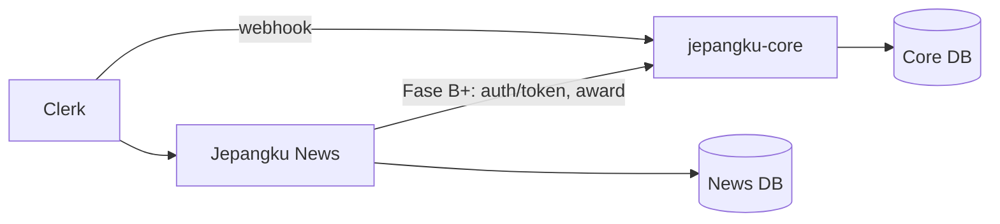

# 🏗️ Tech Stack & Arsitektur

Dokumen ini merangkum stack teknis dan pilihan arsitektur untuk Jepangku News.
Integrasi ekosistem (Core + Clerk): [`ecosystem-integration.md`](./ecosystem-integration.md).

## 📋 Ringkasan

Jepangku News adalah aplikasi **full-stack Next.js** dengan backend API routes dan frontend React dalam satu repository. Strategi ini mempercepat development dan memudahkan deploy awal di Vercel.

Dalam ekosistem JepangKu, News adalah **aplikasi domain berita** — artikel, quiz/poll, komentar — yang mengonsumsi **identitas & gamifikasi global** dari `jepangku-core` setelah cutover (Fase C).

## 🚀 Stack Utama

| Layer | Teknologi | Versi | Keterangan |
|------|-----------|-------|------------|
| Framework | Next.js | 16.x | App Router, server components, API routes |
| UI | React | 19.x | Core rendering dan interaktivitas |
| CSS | Tailwind CSS | 4.x | Utility-first styling; tokens di `app/globals.css` — lihat [design-system.md](./design-system.md) |
| ORM | Prisma | 6.x | Database client, migrations |
| Database | PostgreSQL | Neon | Managed cloud database (domain berita) |
| Storage | Cloudflare R2 | - | S3-compatible object storage |
| Auth | Clerk | - | SSO; session → JIT sync lokal (transisi) |
| Shared identity | jepangku-core | - | XP/poin/role global (Fase B–C) |
| Deployment | Vercel | - | Deploy awal, CI/CD mudah |

## 🧱 Arsitektur Aplikasi

- `app/` : UI dan app routes
- `app/api/` : API backend routes
- `components/` : reusable UI components
- `lib/` : helper utilities (DB client, auth, R2; `lib/core/` rencana Fase B)
- `prisma/` : schema database dan migrations

## 🌐 Posisi dalam Ekosistem

| Data | Lokasi |
|------|--------|
| Artikel, quiz berita, poll, komentar, bookmark | News DB |
| Username, bio (sementara) | News DB |
| Email, name, avatar global, XP, poin, role | Core DB (target) |
| Login, password, OAuth | Clerk |

Peta lengkap: [`jepangku-core/docs/ECOSYSTEM.md`](../../jepangku-core/docs/ECOSYSTEM.md).

## 💾 Database

### PostgreSQL + Neon

Neon dipilih untuk cloud PostgreSQL yang ringan dan managed. Project ini menggunakan Prisma sebagai ORM.

### Schema domain portal (tetap di News)

- `articles`, `categories`, `tags`, `bookmarks`
- `quizzes`, `polls`, `comments`, `reactions`
- `users`, `user_profiles` — **transisi**: akan disederhanakan setelah cutover Core (username/bio saja)

### Schema yang pindah ke Core (Fase C)

- `point_transactions`, `daily_login_rewards`
- Kolom `users.total_points` — diganti claims Core JWT / API

## 📦 Storage

### Cloudflare R2

Digunakan untuk media seperti cover image dan file upload. R2 dipilih karena kompatibilitas S3 dan tanpa biaya egress yang signifikan.

## 🔐 Authentication

Portal memakai **Clerk only** — tidak ada login JWT lokal.

- Sign-in: `/sign-in` · Sign-up: `/sign-up`
- `/login` dan `/register` redirect ke Clerk
- Session → JIT sync ke tabel `users` portal (`clerk_id`, profil, poin lokal — **transisi**)
- **Target Fase C:** Clerk session → Core JWT via `POST /api/v1/auth/token`
- Admin seed: `admin+clerk_test@jepangku.com` — login Clerk dengan email yang sama (OTP dev: `424242`) untuk role `ADMIN` lokal; cutover → Core role `NEWS_EDITOR`

Clerk webhook **tidak** di News — user global disinkronkan ke Core via webhook di `jepangku-core`.

## 🔗 Integrasi Core (Fase B+)

| Variable | Kegunaan |
|----------|----------|
| `CORE_API_URL` | Base URL Core (`http://localhost:8080`) |
| `CORE_SERVICE_TOKEN` | Award XP dari API route backend News |

Alur target: lihat [`ecosystem-integration.md`](./ecosystem-integration.md).

## 🧭 Deployment

### Saat ini
- Vercel untuk deploy awal
- Core: VPS / Docker (`jepangku-core`, port 8080)

### Masa depan
- Fork repo ke organisasi GitHub
- Self-hosted VPS untuk staging / production multi-app
- CI/CD pipeline untuk build dan deploy

## 📌 Kesiapan Multi-App

Arsitektur saat ini sudah menggunakan atribut `source_app` untuk beberapa model. Setelah cutover, FK user mengacu **Clerk ID** (= Core `users.id`) — lihat [`ecosystem-integration.md` §3](./ecosystem-integration.md).

## 📁 Struktur File Penting

- `app/` — halaman publik, auth, user, admin
- `app/api/` — backend API endpoint
- `components/` — reusable UI components
- `lib/auth/` — Clerk session + JIT user
- `lib/points.ts` — poin lokal (**diganti Core API** di Fase C)
- `lib/core/` — client Core (**Fase B**, belum ada)
- `prisma/schema.prisma` — database model

## 🔄 Catatan Pengembangan

Prioritas pengembangan saat ini:
1. Soft launch konten (Fase A)
2. Core bridge + cutover (Fase B–C) — [`development-roadmap.md`](./development-roadmap.md)
3. Perbaikan UX / polish admin
4. LMS nanti (Fase D) — pola consumer Core sama dengan News pasca-cutover
